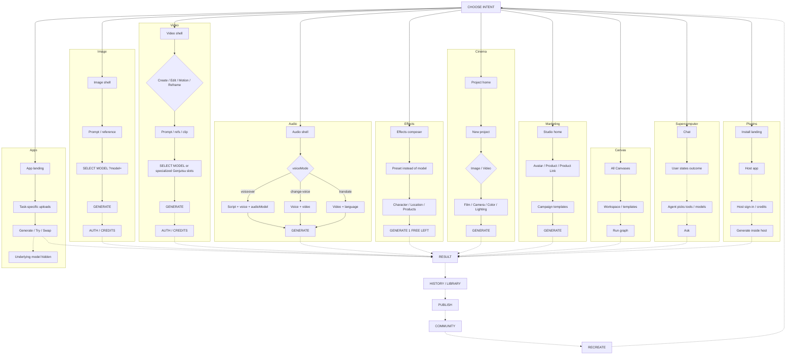
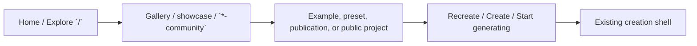

# Product flow graph — last headless mapping pass

**Status:** last broad reconnaissance. Not a substitute for `research/FLOW_MAP.md`. No application code. No rebuild-scope decisions. `FLOW_MAP.md` was not modified.

**Session:** 2026-09-17, Cursor browser tab, **logged out**. No login, signup, upload, generation, credit spend, or access-control bypass. Cookie overlay left in place.

**Sources:** live FEATURE destinations from the captured Image / Video / Audio / Plugins mega-menus; prior live maps in `PRODUCT_MAP.md`, `ROUTE_INVENTORY.md`, `REPEATED_PATTERNS.md`; HAR in `HAR_ANALYSIS.md`.

**Method rule:** `?model=` / `audioModel=` rows are engines unless the UI proved a different shell. Solid edges = live or HAR evidence. Dashed edges = still needs a real walk.

---

## How Higgsfield actually works (one paragraph)

Higgsfield is not a flat list of 80 products. Discovery (Explore, Community, Creation Hub `/flow`, Apps catalog) feeds a small set of **shells**. Image, Video, and Audio are three core generators. Most mega-menu “models” only change the engine inside those shells. A second layer is **packaged Apps / Effects**. A third layer is **edit/transform** (Layers, Upscale, Relight, video Edit/Reframe/Motion). A fourth layer is **named studios** with their own chrome (Cinema, Marketing, Canvas, identity tools, vertical video studios, Lipsync, 3D Jutsu). Supercomputer / MCP / ChatGPT Plugin are **agentic**. `/plugins/{host}` pages are **host-app integrations**, not web generators. Personal work lands in per-surface History plus a cross-product Library; publishing/recreate into Community is still mostly unverified logged out.

---

## 1. Destination classifications

Classifications use: DISCOVERY, CORE GENERATOR, MODEL, MODE / TAB, APP, TRANSFORM, WORKSPACE, AGENTIC, STORAGE, SOCIAL, INTEGRATION / PLUGIN, CONTENT / MARKETING.

Auth: **public composer** = page and controls load logged out. **Generate/upload** still MANUAL. **Profile** is auth-gated.

### 1.1 Discovery

| Final URL | Visible name | User goal | Class | Entry | Primary input | Primary action | Shell | Query / mode | Model | Result dest | Pattern | Auth | Manual |
| --- | --- | --- | --- | --- | --- | --- | --- | --- | --- | --- | --- | --- | --- |
| `https://higgsfield.ai/` | Explore | Browse work, pick a tool | DISCOVERY | Logo, Explore | — | Open card / Recreate / nav | Own home feed | HAR nav-id Motions | — | Recreate → Effects (HAR) | Community feed | Public | Hover, Recreate, home prompt |
| `https://higgsfield.ai/community` (+ `/projects`, `/generations`, `/originals`) | Community | Browse creators’ work | DISCOVERY + SOCIAL | Header Community | — | Open project / shot | Own + subnav | Subroutes | — | Public projects (HAR `/@user/projects/…`) | Feed + tabs | Public | Card Recreate vs Effects Recreate |
| `https://higgsfield.ai/flow` | Creation Hub | Pick a create tool | DISCOVERY | Direct URL (not in primary nav). Bottom bar Home / Community / Library / Profile | Filters All / New / Images / Videos / Edit / Characters / Models | Open a card | Own catalog | Filter chips | Cards include Seedance, Create Image/Video, Genjutsu, Effects, Upscale, Recraft, Ad Multiplier, Grok Bot | Into the named product | Apps-like catalog | Public | Whether Recreate/home also land here |
| `https://higgsfield.ai/apps` | Apps | Browse packaged workflows | DISCOVERY | Catalog; many Features deep-link into slugs | Category routes | Try now | Catalog shell | `/apps/{category}` | Hidden per app | `/apps/{slug}` | Storefront cards | Public | After-job chrome |
| `https://higgsfield.ai/creator-hub` → `/creator-hub/help-center` | Creator Hub / Help Center | Docs, not creation | CONTENT / MARKETING | Footer “Creator Hub” | Search / Ask AI | Read article | Docs chrome | Help categories | — | — | Help center | Public | Not a product flow |

`/flow` is **not** the footer Creator Hub. HAR `/_private/flow/*` matches this Creation Hub family (photodump, mixed-media, video, …).

### 1.2 Image family

| Final URL | Visible name | User goal | Class | Entry | Primary input | Primary action | Shell | Query / mode | Model | Result dest | Pattern | Auth | Manual |
| --- | --- | --- | --- | --- | --- | --- | --- | --- | --- | --- | --- | --- | --- |
| `/ai/image?model=gpt_image_2` | Create Image (header default) | Make an image | CORE GENERATOR | Header Image | Prompt + optional file | Generate 8.5 / 6.5 | **Image shell** | `model=` | GPT Image 2 | History tab (visible); Library **MANUAL** | Core generator | Public composer | Generate / gate |
| `/ai/image?model=nano-banana-2-lite` | Create Image (Features) | Make an image | CORE GENERATOR | Image mega-menu Create Image | Same | Generate | **Same Image shell** | `model=` | Nano Banana 2 Lite | Same | Same | Public | Confirm only default chip differs |
| `/ai/image?model=soul-v2&modal-photo-dump=true` | Photodump | Soul photoset from a preset | MODE / TAB (query/modal) | Image Features | Photodump dialog: preset (Sleepy Head / Zen / …) then character then image | Generate 0.125 | **Image shell** + modal | `model=soul-v2` + `modal-photo-dump=true` | Soul 2.0 | History **MANUAL** | Image + modal | Public dialog | Finish 3-step modal + generate |
| Mega-menu Image Models (except Topaz) | Soul, GPT, Seedream, Nano Banana, Recraft, Grok, FLUX.2, Z-Image, … | Same image job, different engine | MODEL | Image Models column | Same as Image | Generate | **Image shell** | `?model=` | That engine | Same | Model picker | Public | One model switch only |
| `/generate?mode=image&imageModel=cinematic-v1` | Cinematic Cameras | Film-style stills in Cinema | WORKSPACE + MODE | Image Features | Cinema Image/Video tabs, film/camera/color/lighting | GENERATE 80 / 45 (after project) | **Cinema Studio** | Query often **stripped** to `/generate` | `imageModel=cinematic-v1` then Cinema 4.0 | Cinema My generations | Cinema project home | Public | New project → composer; whether imageModel sticks |
| `/canvas` | Canvas | Multi-node workspace | WORKSPACE | Image + Video Features; header | Canvases / templates | Open / Sign in to view | Own | — | Orchestration, not one model chip | All Canvases | Canvas list | Public shell, personal gated | Drag, templates, run |
| `/moodboard` | CREATE YOUR MOODBOARD | Style board | WORKSPACE | Soul Moodboard | Style presets | Generate | Own | — | Not Image `?model=` | **MANUAL** | Preset + Generate | Public | Result storage |
| `/character` | MAKE YOUR OWN CHARACTER | Persistent identity from photos | WORKSPACE | Soul ID Character | Multi-angle photo upload | Create Character | Own | — | Distinct from Influencer and Character Swap | Library filter Characters **inferred** | Upload identity | Public | Upload + create |
| `/ai-influencer-studio` | AI Influencer | Build a synthetic persona | WORKSPACE | Image Features | Type / gender / ethnicity / … | Generate Influencer 2 credits | Own | — | Not Character workspace | **MANUAL** | Form + Generate | Public | Generate / gate |
| `/apps/relight` | Relight | Relight a still | APP + TRANSFORM | Image Features | One image + lighting controls | Generate 2 | **Apps landing** | — | Packaged | **MANUAL** | App SEO + generate | Public | Drag light; job |
| `/layers?model=nano_banana_pro_inpaint` | Inpaint / Edit | Edit an existing image | TRANSFORM | Image Features Inpaint; header Edit is bare `/layers` | Upload Media; carousel Relight / Inpaint / Layer Decomposition / Edit Text / Effects | After upload **MANUAL** | **Layers** | `model=nano_banana_pro_inpaint`; empty landing until media | Inpaint engine named in query | HAR `/layers/$projectId/$versionId` | Layers empty state | Public empty | Upload; inpaint vs other carousel items |
| `/upscale` | Image Upscale / Video Upscale / Topaz | Upscale image or video | TRANSFORM | Image Features, Image Models Topaz, Video Features Video Upscale | Image **or** video (one page) | Generate **MANUAL** | **Own upscale shell** | — | Topaz listed as a “model” but this is the dest | **MANUAL** | Dual-media transform | Public | Image vs video UI; Sora 2 Upscale footer item |
| `/apps/face-swap` | Face Swap | Swap a face | APP + TRANSFORM | Image Features | Target Image + Your Photo | Face Swap Now / Try Generate | **Apps landing** | — | Packaged | **MANUAL** | Two-slot app | Public | Upload + job |
| `/apps/character-swap` | Character Swap 2.0 | Replace a full character in a still | APP + TRANSFORM | Image Features | Your Photo + Target Image | Character Swap 2 | **Apps landing** | — | Packaged; **not** `/character` | **MANUAL** | Same app family as Face Swap | Public | Job vs Soul ID Character |

### 1.3 Video family

| Final URL | Visible name | User goal | Class | Entry | Primary input | Primary action | Shell | Query / mode | Model | Result dest | Pattern | Auth | Manual |
| --- | --- | --- | --- | --- | --- | --- | --- | --- | --- | --- | --- | --- | --- |
| `/ai/video` → `?model=seedance_2_5` | Create Video | Make a video | CORE GENERATOR | Header Video; Features Create Video | Prompt + refs / extend | Generate 80 / 45 | **Video shell** | Tabs Create / Edit / Motion | Default Seedance 2.5 | History | Core generator | Public | Generate / gate |
| `/ai/video?model=genjutsu` | Higgsfield Genjutsu | Recast motion or swap objects | MODEL (specialized config) | Header Genjutsu; Video Models | Reference video 4–30s + up to 30 images; Motion transfer / Objects swap | Generate | **Same Video shell** | `model=genjutsu` | Higgsfield Genjutsu | History + Motion Library + Recreate cards | Video + extra slots | Public | Run vs normal Seedance |
| Other Video Models `?model=` | Seedance, Kling 3.0, Veo, Sora, Wan, MiniMax, DoP (`standard`), HappyHorse, FLUX.3, Grok, Gemini Omni, … | Same video job, different engine | MODEL | Video Models | Same Create Video | Generate | **Video shell** | `?model=` | That engine | History | Change sheet is **wider** than the menu | Public | One Change-sheet sample |
| `/ai/video/edit` → `?model=seedance_2_5_edit` | Edit Video | Edit an existing clip | MODE / TAB + TRANSFORM | Video Features; Video tab | Add a video to edit | Generate | **Video shell**, Edit tab | Path `/edit` | Seedance 2.5 Edit default; Omni Edit uses `kling-video-reference-o3` | History | Video tabs | Public | Upload + job |
| `/ai/video/motion` → `?model=kling-3-motion-control` | Motion Control | Drive a character with a motion clip | MODE / TAB | Video Features; Models Kling Motion Control | Character image + motion video | Generate | **Video shell**, Motion tab | Path `/motion` | Kling 3 Motion Control | History | Video tabs | Public | Upload + job |
| `/ai/video/reframe` | Higgsfield Reframe | Change aspect of a clip | MODE / TAB + TRANSFORM | Video Features | Video 4s–1min + aspect | Generate | **Video shell** | Path `/reframe` | Higgsfield Reframe | History | Video + transform | Public | Saw media-load error; retry with file |
| `/ai/video?video-inpaint=true&generationType=video` → also `&model=seedance_2_5` | Draw to Video | Sketch / inpaint then animate | MODE / TAB (query) | Video Features | Draw to Video / Draw to Edit overlay: Create blank / Upload media | Generate | **Video shell** + overlay | `video-inpaint=true` | Seedance 2.5 auto-attached | History | Query + modal | Public | Actually draw |
| `/ai/video?image-inpaint=true` → `&model=seedance_2_5` | Draw to Edit | Draw edits on a frame | MODE / TAB (query) | Video Features | Same overlay, Draw to Edit | Generate | **Video shell** + overlay | `image-inpaint=true` | Seedance 2.5 | History | Query + modal | Public | Draw vs Video inpaint |
| `/generate?mode=video` → `/generate` | Cinema Studio (video) | Direct a film project | WORKSPACE + MODE | Video Features Cinema Studio; header `/generate` | Image **and** Video tabs on Cinema composer | GENERATE | **Cinema Studio** | `mode` stripped | Cinema 4.0 | My generations / elements / favorites | Cinema project | Public | New project; image vs video tab after generate |
| `/faceless-studio` | Faceless Studio | Faceless channel video | WORKSPACE | Video Features | Channel idea; Education / History / Kids / Storytelling | Next (disabled until input) | Own | — | MCP link on page | History **MANUAL** | Form wizard | Public | Complete wizard; MCP hop |
| `/shorts-studio` | Shorts Studio | Restyle a short | WORKSPACE | Video Features | Upload video; Bold Urban presets; Vertical / Horizontal | Generate | Own | — | Preset, not Video `?model=` | History / How it works | Studio + History | Public | Upload + generate |
| `/explainer` | Higgsfield Explainer | Topic → motion explainer | WORKSPACE | Video Features | Topic prompt; Attach files / Link; Voice Cillian | Generate ~200 | Own | — | Presets match Supercomputer showcases (Editorial Motion Graphics, Stickman, Claymotion, …) | History / How it works | Supercomputer Recreate **dashed** | Public | Recreate from Supercomputer; generate |
| `/mixed-media` | Mixed Media (40+ AI Video Effects Library) | Apply a video effect preset | TRANSFORM (own route) | Video Features | Upload 1–10s video; Change preset | Generate | Own | — | Preset library, not Video model list | Community | Effects-like | Public | Whether results also hit `/effects/use` |
| `/3d-jutsu` | 3D Jutsu | Block out a 3D scene | WORKSPACE | Header + Video Features | Prompt / stage | GENERATE; Export to Seedance 2.5 | Own | — | Seedance named as export engine | **MANUAL** | 3D workspace | Public | Drag staging; export |
| `/apps/link-to-video-ad` → `/marketing-studio?tool=url-to-ad` | Click to Ad | Product URL → ad | WORKSPACE deep-link | Video Features Click to Ad | Marketing Product Link / Ad Reference; Product shot pressed | New project / template | **Marketing Studio** | `tool=url-to-ad` | Marketing templates | My generations | Marketing | Public | Finish URL-to-ad |
| `/apps/video-rehex` | Color Palette | Recolor a video | APP + TRANSFORM | Video Features Change Color Palette | Video + palette **MANUAL** | Generate | **Apps landing** | SEO title wrongly “Video Relighting”; on-page name Color Palette | Packaged | **MANUAL** | App | Public | Job |
| `/apps/video-relight` | Video Relight | Relight a video | APP + TRANSFORM | Video Features Relight | Video + lighting **MANUAL** | Generate | **Apps landing** | SEO title wrongly “Color Palette”; on-page Relight | Packaged; **not** `/apps/relight` | **MANUAL** | App | Public | Job vs image Relight |
| `/lipsync-studio` | Lipsync Studio | Image/video + audio → talking clip | WORKSPACE | Video Features | Image upload; Audio text / Generate Audio; model Wan 2.5 Fast; duration/res | Generate 9 | Own; tabs Lipsync Studio / UGC Factory | — | Lipsync model picker (Wan…), not `/ai/video?model=` | **MANUAL** | Studio composer | Public | Upload + generate |
| `/lipsync-studio?ugc-studio=new` → `?ugc-studio=true` | UGC Factory | UGC promo from same studio | MODE / TAB | Video Features UGC Factory | Same Lipsync inputs | Generate 9 | **Same Lipsync shell** | Canonical `ugc-studio=true`; title “UGC Factory – Fast & Easy UGC Promo Creation” | Same | **MANUAL** | Query/tab | Public | What the tab actually changes |

### 1.4 Audio family

| Final URL | Visible name | User goal | Class | Entry | Primary input | Primary action | Shell | Query / mode | Model | Result dest | Pattern | Auth | Manual |
| --- | --- | --- | --- | --- | --- | --- | --- | --- | --- | --- | --- | --- | --- |
| `/audio?voiceMode=voiceover` → `/audio` | Text to Speech | Script → speech | CORE GENERATOR + MODE | Header Audio; Features TTS | Voice + script `@`; batch 1/4 | Generate | **Audio shell** | `voiceMode` often stripped | Default Seed Audio 1.0 | History | Core generator | Public | Generate / clone voice |
| `/audio?voiceMode=voiceover&audioModel=elevenlabs` → `/audio` | Eleven v3 | Same TTS, Eleven engine | MODEL | Audio Models | Same TTS | Generate | **Audio shell**, TTS tab | `audioModel=elevenlabs` | ElevenLabs v3 chip | History | Engine inside TTS | Public | One engine swap |
| Other Audio Models | Seed Audio, Qwen, MiniMax, Seed Speech | Same TTS | MODEL | Audio Models | Same | Generate | **Audio shell** | `audioModel=` always with `voiceMode=voiceover` | That provider | History | Engine | Public | Do not walk all five |
| `/audio?voiceMode=change-voice` → `/audio` | Voice Change | Swap voice on a clip | MODE / TAB | Audio Features | Pick a voice (required) + upload video (required) | Generate | **Audio shell** | Voice Change tab | **No** `audioModel` chip on this tab | History | Different inputs, same shell | Public | Upload + generate |
| `/audio?voiceMode=translate` → `/audio` | Translate | Dub / lip-sync language | MODE / TAB | Audio Features | Upload video + Language (English default) | Generate | **Audio shell** | Translate tab | No provider chip visible | History | Copy: “Translate and lip-sync” | Public | Upload + generate |

**Rule confirmed:** `voiceMode=` = workflow. `audioModel=` = engine **inside TTS only**. Menu providers are not separate products.

### 1.5 Plugins / integrations / agent surfaces

| Final URL | Visible name | User goal | Class | Host product | In HF create flow? | Direction | Own flow family? | Shell | Notes | Manual |
| --- | --- | --- | --- | --- | --- | --- | --- | --- | --- | --- |
| `/plugins/after-effects` | Higgsfield inside After Effects | Install panel in AE | INTEGRATION / PLUGIN | Adobe After Effects | No — install/docs | **HF → host** (generate image/video, reframe, draw-to-edit, upscale drop into timeline) | No (shared plugin landing) | Plugin landing + host tabs | Download .dmg; Window → Extensions → Higgsfield | Install + use in AE |
| `/plugins/premiere-pro` | Inside Premiere Pro | Install in Premiere | INTEGRATION / PLUGIN | Adobe Premiere Pro | No | HF → host | No | **Same landing family** | Title shared with AE; installer copy still mentions AE in places | Whether Premiere panel actually differs |
| `/plugins/photoshop` | Inside Photoshop | Install in PS | INTEGRATION / PLUGIN | Adobe Photoshop | No | HF → host | No | Same family, host-specific caps | .ccx; Realtime AI, Mockup Studio, Layer Decompose | Install |
| `/plugins/davinci` | Inside DaVinci Resolve | Install in Resolve | INTEGRATION / PLUGIN | DaVinci Resolve | No | HF → host | No | Same family | .pkg; Workspace → Workflow Integrations; AI LUT Creator | Install |
| `/plugins/figma` | Inside Figma | Add Figma plugin | INTEGRATION / PLUGIN | Figma / FigJam | No | HF → host; “same login as the web app” | No | Same family, **Add to figma** not Download | Generate / Relight / Expand on canvas | Sign-in in Figma |
| `/plugins/blender` | Inside Blender | Viewport add-on | INTEGRATION / PLUGIN | Blender | No | HF → host; also MCP “Build … in Blender” | Partial (3D Scene Builder is unique copy) | Same family + Blender toolkit | .zip drag-install; Image/Video/3D/Animation | Install + generate in Blender |
| `/plugins/minecraft` | Higgsfield AI inside Minecraft | In-game generate | INTEGRATION / PLUGIN | Minecraft (NeoForge 1.21.1) | No | HF → game (Supercomputer block, Camera, Photo Slide, Film Roll / Kling 3) | **Yes, distinct install story** | **Different page** (not in host tab bar) | .jar + `/higgsfield auth`; unofficial mod disclaimer | In-game auth + generate |
| `/mcp` | MCP / CLI | Connect agents to HF models | AGENTIC + INTEGRATION | ChatGPT, Claude, Cursor, … | Connector, not the web composer | **HF into agents** (`bridge.higgsfield.ai/mcp`) | Related to Supercomputer / ChatGPT Plugin | Marketing + install | Prior pass | Connect a client |
| `/gpt-astra` | ChatGPT Plugin | Skills & presets in ChatGPT | AGENTIC + INTEGRATION | ChatGPT Astra | Preset catalog | **HF into ChatGPT** (“Install Higgsfield plugin”, Try in ChatGPT) | Related, not `/plugins/*` | Skills catalog | After Effects motion-design presets; Recreate in ChatGPT `codex://` links | Install in ChatGPT |
| Header **API** | API | Programmatic access | INTEGRATION / PLUGIN | `https://console.higgsfield.ai` | External console | App → HF API | Separate from web create | Header href is console; footer also `/higgsfield-api` | Not opened (would be another product surface) | Console auth |
| `/cinematic-video-generator` | Cinema marketing | SEO | CONTENT / MARKETING | — | No | CTA into `/generate` **dashed** | No | Marketing page | Not Cinema workspace | CTA click |

Plugins **bring Higgsfield into another tool**. They do not replace Image/Video/Audio on the web. Minecraft is the only plugin destination with a clearly different landing and in-world Supercomputer metaphor.

---

## 2. Collapse duplicate entry points

| Visible menu item | Destination | Underlying product / workflow | Type of difference |
| --- | --- | --- | --- |
| Header **Image** | `/ai/image?model=gpt_image_2` | Image generator | alternate default model |
| Features **Create Image** | `/ai/image?model=nano-banana-2-lite` | Image generator | alternate default model |
| Image Models (Soul, GPT variants, Seedream, Nano Banana, Recraft, Grok, FLUX.2, Z-Image, …) | `/ai/image?model=…` | Image generator | model selection |
| **Photodump** | `/ai/image?model=soul-v2&modal-photo-dump=true` | Image generator + Soul + dialog | query/modal state |
| **Topaz** (listed as Image Model) | `/upscale` | Upscale | duplicate entry point (mis-filed as model) |
| **Image Upscale** | `/upscale` | Upscale | duplicate entry point |
| **Video Upscale** | `/upscale` | Upscale | duplicate entry point (same page, dual media) |
| Header **Video** / **Create Video** | `/ai/video` → Seedance 2.5 | Video generator | duplicate entry point |
| Video Models (most `?model=`) | `/ai/video?model=…` | Video generator | model selection |
| Header **Genjutsu** / Models **Higgsfield Genjutsu** | `/ai/video?model=genjutsu` | Video generator + specialized slots | specialized configuration |
| **Kling 3.0** | `/ai/video?model=kling3_0` | Video generator | model selection |
| **Kling Motion Control** | `/ai/video/motion` | Video generator, Motion tab | tab/mode |
| **Kling 3.0 Omni Edit** | `/ai/video/edit?model=kling-video-reference-o3` | Video generator, Edit tab | tab/mode + model selection |
| **Edit Video** | `/ai/video/edit` | Video generator, Edit tab | tab/mode |
| **Higgsfield Reframe** | `/ai/video/reframe` | Video generator, Reframe | tab/mode |
| **Draw to Video** | `/ai/video?video-inpaint=true&generationType=video` | Video generator + inpaint overlay | query/modal state |
| **Draw to Edit** | `/ai/video?image-inpaint=true` | Video generator + inpaint overlay | query/modal state |
| **Cinematic Cameras** | `/generate?mode=image&imageModel=cinematic-v1` → `/generate` | Cinema Studio | tab/mode (Cinema Image) |
| Header **Cinema Studio** | `/generate` | Cinema Studio | duplicate entry point |
| Video **Cinema Studio** | `/generate?mode=video` → `/generate` | Cinema Studio | tab/mode (Cinema Video; query stripped) |
| `/cinematic-video-generator` | marketing URL | Cinema Studio (docs/SEO) | marketing/SEO page |
| **Canvas** (Image menu and Video menu) | `/canvas` | Canvas | duplicate entry point |
| **Inpaint** | `/layers?model=nano_banana_pro_inpaint` | Layers / Edit | specialized configuration |
| Header **Edit** | `/layers` | Layers / Edit | duplicate entry point (no model query) |
| **Relight** (Image) | `/apps/relight` | Image Relight app | genuinely separate workflow vs Video Relight |
| **Relight** (Video) | `/apps/video-relight` | Video Relight app | genuinely separate workflow |
| **Change Color Palette** | `/apps/video-rehex` | Color Palette app | genuinely separate workflow (SEO titles swapped with Video Relight) |
| **Face Swap** | `/apps/face-swap` | Face Swap app | genuinely separate workflow |
| **Character Swap** | `/apps/character-swap` | Character Swap app | genuinely separate workflow |
| **Soul ID Character** | `/character` | Character workspace | genuinely separate workflow |
| **AI Influencer** | `/ai-influencer-studio` | Influencer workspace | genuinely separate workflow |
| **Soul Moodboard** | `/moodboard` | Moodboard workspace | genuinely separate workflow |
| **Click to Ad** | `/apps/link-to-video-ad` → `/marketing-studio?tool=url-to-ad` | Marketing Studio | specialized configuration / deep-link |
| Header **Marketing Studio** | `/marketing-studio` | Marketing Studio | duplicate entry point |
| **Faceless / Shorts / Explainer / Mixed Media / 3D Jutsu** | own routes | own workspaces (Mixed Media is effect-preset-like) | genuinely separate workflow |
| **Lipsync Studio** | `/lipsync-studio` | Lipsync workspace | genuinely separate workflow |
| **UGC Factory** | `/lipsync-studio?ugc-studio=true` | Lipsync workspace | query/modal state / tab |
| Header **Audio** / **Text to Speech** | `/audio` TTS | Audio generator | duplicate entry point |
| **Voice Change** / **Translate** | `/audio` + tab | Audio generator | tab/mode |
| Seed Audio / Eleven / Qwen / MiniMax / Seed Speech | `/audio?voiceMode=voiceover&audioModel=…` | Audio TTS | model selection |
| Header **Effects** | `/effects/use` (FLOATING FALL) | Effects | duplicate vs catalog **MANUAL** |
| Header **Plugins** | `/plugins/after-effects` | Plugin landing | duplicate entry point (default host) |
| Photoshop / Premiere / AE / DaVinci / Figma / Blender | `/plugins/{host}` | Shared plugin-install family | integration/plugin (host variant) |
| **Minecraft** | `/plugins/minecraft` | Minecraft mod | integration/plugin (distinct landing) |
| Header **MCP** / **ChatGPT Plugin** | `/mcp`, `/gpt-astra` | Agent install | integration/plugin (not the Plugins mega-menu) |
| Header **API** | `console.higgsfield.ai` | API console | integration/plugin |
| Header **Genjutsu** vs Video Models Genjutsu | same URL | Video + Genjutsu | duplicate entry point |
| Footer **Creator Hub** | `/creator-hub/help-center` | Help center | marketing/SEO page |
| Direct **Creation Hub** | `/flow` | Tool catalog | genuinely separate **discovery** surface (not in header) |

---

## 3. Graph 1 — Product architecture

Solid = live/HAR. Dashed = needs a real walk.

```mermaid
flowchart TB
  subgraph discovery [Discovery]
    Explore["Explore /"]
    Community["Community"]
    Flow["Creation Hub /flow"]
    AppsCat["Apps catalog"]
  end

  subgraph core [Core creation]
    Image["Image /ai/image"]
    Video["Video /ai/video"]
    Audio["Audio /audio"]
  end

  subgraph packaged [Packaged workflows]
    Apps["Apps /apps/slug"]
    Effects["Effects /effects/use"]
  end

  subgraph transform [Editing / transformation]
    Layers["Layers /layers"]
    Upscale["Upscale /upscale"]
    ImgRelight["Image Relight app"]
    VidRelight["Video Relight app"]
    Rehex["Color Palette app"]
    Face["Face / Character Swap apps"]
    VidModes["Video Edit / Motion / Reframe"]
  end

  subgraph workspaces [Specialized workspaces]
    Cinema["Cinema Studio /generate"]
    Marketing["Marketing Studio"]
    Canvas["Canvas"]
    Mood["Moodboard"]
    Char["Soul ID Character"]
    Infl["AI Influencer"]
    Faceless["Faceless Studio"]
    Shorts["Shorts Studio"]
    Explainer["Explainer"]
    Mixed["Mixed Media"]
    Lipsync["Lipsync Studio"]
    Jutsu["3D Jutsu"]
  end

  subgraph agentic [Agentic]
    Super["Supercomputer"]
    MCP["MCP / CLI"]
    GPT["ChatGPT Plugin /gpt-astra"]
  end

  subgraph plugins [Plugins / integrations]
    HostPlugins["Adobe / Figma / Blender install landings"]
    Minecraft["Minecraft mod"]
    API["API console"]
  end

  subgraph userwork [User work]
    History["Per-surface History"]
    Library["Library /library/all"]
    CinemaRail["Cinema generations / elements"]
    MktRail["Marketing generations"]
    CanvasList["All Canvases"]
  end

  subgraph social [Creator / social]
    Profile["Profile /auth"]
    PublicProj["Public /@user/projects HAR"]
    Blogs["Blog / Originals"]
  end

  Explore -->|discover| Image
  Explore -->|discover| Video
  Explore -->|discover Recreate HAR| Effects
  Explore -->|discover| Community
  Flow -->|create| Image
  Flow -->|create| Video
  Flow -->|create| Effects
  Flow -->|create| Upscale
  AppsCat -->|open in| Apps
  Community -->|discover| PublicProj

  Image -->|select model| Image
  Video -->|select model| Video
  Video -->|tab| VidModes
  Audio -->|voiceMode| Audio

  Image -->|open in| Cinema
  Video -->|open in| Cinema
  Image -->|open in| Canvas
  Video -->|open in| Canvas
  Video -->|open in| Lipsync
  Video -->|open in| Faceless
  Video -->|open in| Shorts
  Video -->|open in| Explainer
  Video -->|open in| Mixed
  Video -->|open in| Jutsu
  Video -->|open in| Marketing
  Image -->|open in| Mood
  Image -->|open in| Char
  Image -->|open in| Infl
  Image -->|edit| Layers
  Image -->|edit| Upscale
  Image -->|edit| ImgRelight
  Image -->|edit| Face
  Video -->|edit| Upscale
  Video -->|edit| VidRelight
  Video -->|edit| Rehex
  Jutsu -.->|continue in Seedance| Video

  Super -->|create| Super
  Super -.->|recreate| Explainer
  MCP -->|integrate with| Super
  GPT -->|integrate with| MCP
  HostPlugins -->|integrate with| Image
  HostPlugins -->|integrate with| Video
  Minecraft -->|integrate with| Super
  API -->|integrate with| core

  Image -.->|store| History
  Video -.->|store| History
  Audio -.->|store| History
  History -.->|store| Library
  Cinema -.->|store| CinemaRail
  Marketing -.->|store| MktRail
  Canvas -.->|store| CanvasList
  Library -.->|publish| Community
  PublicProj -.->|recreate| Effects
  Profile -.->|publish| PublicProj
```



**Not placed as a public creation family:** Fashion Factory, Popcorn / storyboard-generator (footer only this pass). **`/flow` is live** as Creation Hub. **`/creator-hub` is help**, not this graph’s Creation Hub.

---

## 4. Graph 2 — Reusable creation lifecycle

```mermaid
flowchart LR
  D[DISCOVER] --> I[CHOOSE INTENT]
  I --> W[ENTER WORKFLOW]
  W --> P[PROVIDE INPUT]
  P --> M[SELECT MODEL / PRESET]
  M --> C[CONFIGURE]
  C --> G[GENERATE / RUN]
  G --> A[AUTH / CREDIT GATE]
  A --> X[PROCESSING]
  X --> R[RESULT]
  R --> F[FOLLOW-UP]
  F --> H[HISTORY / LIBRARY]
  H --> U[PUBLISH]
  U --> S[PROFILE / COMMUNITY]
  S --> RC[RECREATE]
  RC --> W
```



Dashed below = not proven with a real job this pass.



**Where families diverge (live):**

- **Image:** explicit `?model=` chip.
- **Video:** Create/Edit/Motion **routes**; Genjutsu adds motion-transfer UI; Draw flags open an overlay.
- **Audio:** `voiceMode` changes required inputs; `audioModel` only on TTS.
- **Effects:** preset name, not foundation-model picker.
- **Apps:** SEO landing + constrained slots; implementation hidden.
- **Cinema:** project chrome + filmmaking controls; Image/Video are tabs inside Cinema, not `/ai/image` vs `/ai/video`.
- **Marketing:** product/avatar/campaign templates; Click to Ad is `tool=url-to-ad`.
- **Canvas:** list/templates, not a linear generate form.
- **Supercomputer:** chat / Ask / Skills / Connectors; Recreate cards look like Explainer presets (**dashed**).
- **Plugins:** install → other application; credits claimed shared with web (Figma copy) — **dashed** until used.

---

## 5. Graph 3 — Entry-point collapsing

```mermaid
flowchart TB
  subgraph imageMenu [Image mega-menu]
    CreateImg[Create Image]
    HeaderImg[Header Image]
    Photo[Photodump]
    CinCam[Cinematic Cameras]
    RelightI[Relight]
    Inpaint[Inpaint]
    UpscaleI[Image Upscale / Topaz]
    Face[Face Swap]
    CSwap[Character Swap]
    Mood[Moodboard]
    Char[Soul ID Character]
    Infl[AI Influencer]
    CanI[Canvas]
    ImgModels[All other Image Models]
  end

  ImgShell[Image generator]
  Cinema[Cinema Studio]
  Layers[Layers / Edit]
  Upscale[Upscale]
  AppShell[Apps landing family]
  Canvas[Canvas workspace]

  HeaderImg -->|alternate default model| ImgShell
  CreateImg -->|alternate default model| ImgShell
  ImgModels -->|model selection| ImgShell
  Photo -->|Soul + Photodump modal| ImgShell
  CinCam -->|Cinema image mode| Cinema
  RelightI --> AppShell
  Face --> AppShell
  CSwap --> AppShell
  Inpaint --> Layers
  UpscaleI --> Upscale
  Mood --> MoodWS[Moodboard workspace]
  Char --> CharWS[Character workspace]
  Infl --> InflWS[Influencer workspace]
  CanI --> Canvas

  subgraph videoMenu [Video mega-menu]
    CreateVid[Create Video]
    Genj[Genjutsu]
    EditV[Edit Video]
    Motion[Motion Control]
    Reframe[Reframe]
    DrawV[Draw to Video]
    DrawE[Draw to Edit]
    CinV[Cinema]
    FaceS[Faceless]
    Shorts[Shorts]
    Expl[Explainer]
    Mixed[Mixed Media]
    Lip[Lipsync]
    UGC[UGC Factory]
    ClickAd[Click to Ad]
    RelightV[Video Relight]
    Palette[Color Palette]
    UpscaleV[Video Upscale]
    Jutsu[3D Jutsu]
    CanV[Canvas]
    VidModels[Typical Video Models]
  end

  VidShell[Video generator]
  Marketing[Marketing Studio]
  Lipsync[Lipsync Studio]

  CreateVid --> VidShell
  VidModels -->|model selection| VidShell
  Genj -->|specialized model config| VidShell
  EditV -->|Edit tab| VidShell
  Motion -->|Motion tab| VidShell
  Reframe -->|Reframe route| VidShell
  DrawV -->|inpaint query + overlay| VidShell
  DrawE -->|inpaint query + overlay| VidShell
  CinV -->|Cinema video mode| Cinema
  FaceS --> FaceWS[Faceless workspace]
  Shorts --> ShortWS[Shorts workspace]
  Expl --> ExplWS[Explainer workspace]
  Mixed --> MixedWS[Mixed Media preset workspace]
  Lip --> Lipsync
  UGC -->|ugc-studio tab| Lipsync
  ClickAd -->|tool=url-to-ad| Marketing
  RelightV --> AppShell
  Palette --> AppShell
  UpscaleV --> Upscale
  Jutsu --> JutsuWS[3D Jutsu workspace]
  CanV --> Canvas

  subgraph audioMenu [Audio mega-menu]
    TTS[Text to Speech]
    VChange[Voice Change]
    Transl[Translate]
    AModels[Seed / Eleven / Qwen / MiniMax / Seed Speech]
  end

  AudShell[Audio generator]
  TTS -->|voiceMode=voiceover| AudShell
  VChange -->|voiceMode=change-voice| AudShell
  Transl -->|voiceMode=translate| AudShell
  AModels -->|audioModel on TTS only| AudShell

  subgraph pluginMenu [Plugins mega-menu]
    AE[After Effects]
    PR[Premiere]
    PS[Photoshop]
    DV[DaVinci]
    FG[Figma]
    BL[Blender]
    MC[Minecraft]
  end

  PluginLand[Shared host-install landing]
  AE --> PluginLand
  PR --> PluginLand
  PS --> PluginLand
  DV --> PluginLand
  FG --> PluginLand
  BL --> PluginLand
  MC --> MCLand[Minecraft mod landing]
  PluginLand -->|HF inside host| HostApp[Adobe / Figma / Blender]
  MCLand -->|HF inside game| Minecraft
```



---

## 6. Evidence table

| Relationship | Confidence | Evidence | Manual verification needed |
| --- | --- | --- | --- |
| Header Image and Create Image share Image shell, different default `model` | LIVE HEADLESS CONFIRMED | Header `gpt_image_2`; Features `nano-banana-2-lite`; same composer | Only the chip / cost delta |
| Photodump = Image + Soul 2.0 + modal | LIVE HEADLESS CONFIRMED | URL + Photodump dialog presets + Generate 0.125 | Complete 3 steps + generate |
| Image Models are `?model=` engines | LIVE HEADLESS CONFIRMED + MANUAL DOM | Mega-menu hrefs | One Change/model switch |
| Topaz / Image Upscale / Video Upscale = `/upscale` | LIVE HEADLESS CONFIRMED | One page, image and video | Dual-mode generate |
| Inpaint = Layers + model query; empty until upload | LIVE HEADLESS CONFIRMED | Same empty Layers landing; carousel includes INPAINT | Upload; inpaint vs other tools |
| Cinematic Cameras and Video Cinema = Cinema `/generate` | LIVE HEADLESS CONFIRMED | Both land on Cinema 4.0; `mode` stripped; Image/Video tabs on composer | New project; whether `imageModel` applies |
| Cinema marketing URL ≠ workspace | LIVE HEADLESS CONFIRMED | `/cinematic-video-generator` vs `/generate` | CTA from marketing page |
| Genjutsu = Video shell + specialized UI | LIVE HEADLESS CONFIRMED | Create/Edit/Motion tabs; Motion transfer / Objects swap; model chip Higgsfield Genjutsu | Job vs Seedance |
| Edit / Motion / Reframe are Video routes/tabs | LIVE HEADLESS CONFIRMED | `/ai/video/edit`, `/motion`, `/reframe`; Edit Video / Motion Control labels | Upload + generate each once |
| Draw to Video / Draw to Edit = Video + query overlay | LIVE HEADLESS CONFIRMED | Flags kept; overlay Draw to Video / Draw to Edit; model Seedance 2.5 | Actual drawing |
| UGC Factory = Lipsync + `ugc-studio=true` | LIVE HEADLESS CONFIRMED | Canonical query; same composer; SEO title UGC Factory | What the tab changes after click |
| Click to Ad → Marketing `tool=url-to-ad` | LIVE HEADLESS CONFIRMED | Redirect from `/apps/link-to-video-ad` | Finish Product Link flow |
| Image Relight ≠ Video Relight | LIVE HEADLESS CONFIRMED | `/apps/relight` vs `/apps/video-relight`; SEO titles swapped with Color Palette | Jobs |
| Color Palette = `/apps/video-rehex` | LIVE HEADLESS CONFIRMED | On-page Color Palette | Job |
| Face Swap and Character Swap share Apps shell; Character workspace is separate | LIVE HEADLESS CONFIRMED | `/apps/character-swap` vs `/character` | Jobs; Soul ID vs swap |
| Moodboard / Character / Influencer are own workspaces | LIVE HEADLESS CONFIRMED | Distinct H1s and inputs | Generate each |
| Faceless / Shorts / Explainer / Mixed Media own routes | LIVE HEADLESS CONFIRMED | Distinct inputs; Shorts/Explainer History + How it works | Generate each |
| Explainer presets related to Supercomputer Recreate | STRONGLY INFERRED | Matching preset names | Click Recreate on Supercomputer |
| 3D Jutsu exports to Seedance | LIVE HEADLESS CONFIRMED (label) | “Export to Seedance 2.5” | Actual export |
| Audio `voiceMode` vs `audioModel` | LIVE HEADLESS CONFIRMED | TTS shows ElevenLabs v3 from `audioModel`; Voice Change / Translate hide provider chip; queries strip to `/audio` | Generate each mode |
| `/flow` is Creation Hub catalog | LIVE HEADLESS CONFIRMED | Title Creation Hub; tool cards | Whether header ever links here |
| Footer Creator Hub is Help Center | LIVE HEADLESS CONFIRMED | `/creator-hub` → `/creator-hub/help-center` | — |
| Plugin hosts share one landing family | LIVE HEADLESS CONFIRMED | Host tabs; “HIGGSFIELD IS NOW INSIDE {HOST}”; Download / Add to Figma | Install one Adobe + Figma |
| Minecraft is a different integration | LIVE HEADLESS CONFIRMED | Unique page, NeoForge, Supercomputer block | In-game |
| ChatGPT Plugin ≠ Plugins mega-menu | LIVE HEADLESS CONFIRMED | `/gpt-astra` skills catalog; header item | Install in ChatGPT |
| Header API → console.higgsfield.ai | LIVE HEADLESS CONFIRMED | Header href | Console auth |
| Home Recreate → Effects | HAR CONFIRMED | HAR Recreate → `/effects/use/{slug}` | Click Recreate logged in |
| `/_private/flow/*` backs Creation Hub family | HAR CONFIRMED | Manifest keys photodump, mixed-media, video, … | — |
| Library is cross-product | LIVE HEADLESS CONFIRMED (filters) | Filters Video, Image, Shorts, Explainer, Audio, Marketing, Characters, Lipsync | Fill after real jobs |
| History vs Library vs Cinema rails sync | UNKNOWN | Different empty rails logged out | After one job, check all three |
| Publish to profile / community | UNKNOWN | Publish not visible logged out | After a job |
| Generate click = Clerk vs spend vs job | UNKNOWN | Costs visible logged out | One cheap/free generate |
| Auth UI | UNKNOWN | `/profile` → `/auth/sign-in`; Clerk did not hydrate headless | Real login |
| Fashion Factory / Popcorn product UIs | UNKNOWN | Footer hrefs only | Open if assignment cares |
| Mixed Media vs Effects catalog | UNKNOWN | Mixed Media is a preset library on `/mixed-media` | Whether they share jobs |
| Canvas run / templates | UNKNOWN | List + Sign in CTA | Logged-in canvas |
| Faceless MCP hop | UNKNOWN | MCP link on Faceless | Click through |

---

## 7. Final synthesis

### 1. Genuinely distinct end-to-end workflow families

1. **Discovery** — Explore, Community, Creation Hub `/flow`, Apps catalog  
2. **Image generator** — `/ai/image`  
3. **Video generator** — `/ai/video` including Edit / Motion / Reframe / Draw / Genjutsu  
4. **Audio generator** — `/audio` TTS / Voice Change / Translate  
5. **Effects** — preset composer  
6. **Apps** — packaged one-task landings  
7. **Layers / Edit** — `/layers`  
8. **Upscale** — `/upscale`  
9. **Cinema Studio** — `/generate`  
10. **Marketing Studio** — including Click to Ad  
11. **Canvas**  
12. **Identity cluster** — Moodboard, Soul ID Character, AI Influencer (three UIs, related job)  
13. **Vertical video studios** — Faceless, Shorts, Explainer, Mixed Media  
14. **Lipsync Studio** — including UGC Factory tab  
15. **3D Jutsu**  
16. **Supercomputer**  
17. **Integrations** — host plugins, Minecraft, MCP, ChatGPT Plugin, API  
18. **Storage / social** — Library, History, Profile, public projects  

Image Relight, Video Relight, Color Palette, Face Swap, and Character Swap are **Apps** (family 6) with transform jobs, not extra core generators.

### 2. How many remain after collapsing?

About **18 families**, not the 70–90 mega-menu rows. Inside those, **three core generators** absorb almost all `?model=` / `audioModel=` items. Video’s extra Features mostly collapse to **tabs, queries, or other families already listed**.

### 3. Menu items that are only alternate ways in

Header Image vs Create Image; almost all Image and Video Models; all Audio Models; Header Video / Create Video; Header Genjutsu; Header Cinema vs Cinematic Cameras vs Video Cinema; Canvas in both Image and Video menus; Topaz + both Upscale rows; Header Edit vs Inpaint (same Layers); UGC Factory; Draw to Video / Draw to Edit; Click to Ad vs Marketing; Header Plugins vs After Effects; six of seven plugin hosts (not Minecraft).

### 4. Surfaces that share a shell

- **Image shell:** header Image, Create Image, Photodump, Image Models  
- **Video shell:** Create / Edit / Motion / Reframe / Draw / Genjutsu / typical models  
- **Audio shell:** TTS / Voice Change / Translate / audioModel  
- **Cinema shell:** `/generate` image and video modes  
- **Apps landing:** Face Swap, Character Swap, Relight, Video Relight, Color Palette (sampled)  
- **Plugin landing:** Photoshop, Premiere, After Effects, DaVinci, Figma, Blender  
- **Lipsync shell:** Lipsync + UGC Factory  
- **Upscale shell:** image and video  
- **Layers shell:** header Edit + Inpaint query  

### 5. Genuinely standalone mini-products / workspaces

Cinema, Marketing, Canvas, Moodboard, Character, AI Influencer, Faceless, Shorts, Explainer, Mixed Media, Lipsync, 3D Jutsu, Supercomputer, Minecraft plugin landing. Effects is a composer of its own. Creation Hub `/flow` is a catalog, not a generator.

### 6. Plugins: product vs marketing

All seven mega-menu items are **real integration/install products**, not Image/Video composers. Six share a marketing/install shell that **puts Higgsfield inside the host**. Minecraft is a **mod + in-world Supercomputer**. ChatGPT Plugin and MCP are **agent integrations**, separate header items. Copy says generate-in-host and shared credits (Figma); **using** the plugin is still MANUAL. They do **not** deserve Image-like user-flow families on the web.

### 7. Still UNKNOWN

Auth/Clerk; whether Generate spends or gates; async processing; result → History → Library sync; Publish; Recreate Supercomputer → Explainer; Mixed Media vs Effects identity; Canvas execution; Fashion Factory / Popcorn; API console; plugin-in-host behavior; Faceless MCP; public profile when logged in.

### 8. Flows that need a real manual walkthrough

One **Image** generate (or gate) + one model switch + Photodump modal to the end. One **Video** generate + glance Edit/Motion (do not pay three times). **Genjutsu** only if motion-transfer must be proven. **Audio** TTS + Voice Change **or** Translate with a clip. **Effects** free generate. **Cinema** New project. **Marketing** Product Link (Click to Ad). **Layers** with an upload. **Upscale** image or video. **Lipsync** tab vs UGC. **One** identity workspace (Character **or** Influencer). **Supercomputer** Recreate click. **Library** after a job. **Community** Recreate. **Profile** login (only if you intend to). **One** Adobe plugin page is enough on the web; in-host use is optional.

### 9. Flows that can be represented by one shared pattern

All Image Models except Topaz. All typical Video Models except Motion Control, Omni Edit, Genjutsu. All Audio Models (TTS only). Six host plugins except Minecraft. Apps catalog cards after Face Swap + Relight + one video app. Community subnav. History + How it works on Image/Video/Audio/Shorts/Explainer. Creation Hub cards that only deep-link into shells already walked.

### 10. Shortest manual walkthrough that validates the product model

Do **not** test every model, app, studio, or plugin.

1. **Explore** — open a Recreate card (expect Effects).  
2. **Creation Hub `/flow`** — confirm it is a picker into Image / Video / Effects / Upscale, not a generator.  
3. **Image** — one prompt (expect auth/credit gate or a job). Switch one model. Open Photodump, do not need a second paid job.  
4. **Video** — land on Create; click Edit and Motion tabs; do not generate three times. Peek Genjutsu UI.  
5. **Audio** — TTS visible engine; click Voice Change (different inputs).  
6. **Effects** — cheapest/free Generate if you will spend anything.  
7. **Cinema** — New project; note Image/Video tabs are Cinema, not `/ai/*`.  
8. **Marketing** — Product Link / Click to Ad query.  
9. **Layers** — upload one still (Inpaint). **Upscale** — confirm image+video.  
10. **One App** — Face Swap or Relight, stop at the gate.  
11. **Lipsync** — UGC tab. **One studio** — Explainer **or** Shorts (History pattern).  
12. **Supercomputer** — click Recreate on a showcase (does it go to Explainer?).  
13. **Library** — does the job appear? **Community** — Recreate vs Effects.  
14. **Plugins** — After Effects landing only. Optional: Figma “Add to figma” vs Minecraft.  
15. **Profile / Login** — only if you want the social/storage half; do not bypass auth.

That sequence validates shells, collapsing, and the discover → create → store → publish → recreate loop without enumerating engines.

---

## Home / Explore discovery layer

**Status:** targeted Home gallery pass, 2026-09-17, logged out. Not a new product family. `*-community` / preset / project URLs are **discovery surfaces** over shells already in this file. No new execution shell was proven. `FLOW_MAP.md` was not modified. No generations, credits, or login.

**Relationship (all nine galleries):**



Home is a **shortcut + showcase** layer. A gallery heading is not a product. Recreate is what names the shell.

### Pattern

| Layer | What it is | What it is not |
| --- | --- | --- |
| Home section | Horizontal strip of presets or community-style cards | A generator |
| View all / header | Often `/effects`, `/higgsfield-genjutsu-presets`, or a `*-community` marketing/SEO landing | A new workflow family |
| Card click | Effects example page, Genjutsu preset **modal** (URL stays `/`), `/publications/{id}`, or `/@user/projects/{slug}` | The creation shell |
| Recreate / Create | Enters Image, Video, Effects, or Marketing with a model/preset/job query | A community product |

**Like:** heart controls are **Like** (`LikeAction` in JSON-LD; accessible name `Like`). Logged-out Like on a publication opened **Welcome to Higgsfield** (Google / Apple / Microsoft / Email). `aria-pressed` did **not** change. Authenticated Like → profile / library / favorites was **not** tested. Do not rename Like to Favorite/Save.

**Home card caveat:** several community galleries (Seedance, GPT Image 2, Marketing, Soul) render as media tiles with creator hover + Like in a real browser. In this headless pass those tiles often had **no loaded media and no `Like` in the a11y tree**. Card destinations below use one representative live click **or** the JSON-LD/`/publications/{id}` object those galleries list, plus the View-all CTA.

### Gallery → shell table

| Home gallery | Gallery URL | Card type | Hover actions | Card click behavior | Recreate/Create URL | Prefilled state | Existing underlying shell | New workflow? |
|---|---|---|---|---|---|---|---|---|
| Visual Effects | `/effects` (heading); Try for free `/effects/use`; View all presets `/effects` | Effect preset tiles | Recreate overlay (often `opacity: 0` until hover); View `{preset}` | **Not a modal.** Representative **Floating fall** → `/effects/examples/floating-fall` (example/detail). | Home Recreate → `/effects/use/{slug}` (e.g. `/effects/use/floating-fall`). Example page **Try for free** → same composer. Some Recreate hrefs add `?recreateJobId={uuid}`. | Composer title FLOATING FALL; Character / Location / Products slots; Generate **1 FREE LEFT**. | **Effects** | **NO** |
| Higgsfield Genjutsu | `/higgsfield-genjutsu-presets`; Start generating `/ai/video?model=genjutsu` | Preset tiles with **Open preset** (not community Like cards) | Recreate this example / Expand example / Show source video / variants (on cards) | **Open preset** opens a **modal on Home** (URL stays `/`). Prompt + **Model: Higgsfield Genjutsu - Object Swap**. Recreate + Download on the modal. | Direct CTA `/ai/video?model=genjutsu`. Logged-out **Recreate** on the modal → Welcome to Higgsfield auth (closed, not signed in). After auth, expected Video + Genjutsu — **not completed**. | Modal prompt: “Replace the scene location with the environment from my references and change the characters”. Object Swap Genjutsu config. | **Video** + specialized Genjutsu inputs | **NO** |
| Seedance 2.5 | `/seedance-2-5-community` | Intended: community-style video cards + Like. Headless Home tiles were empty placeholders. | Known: creator/profile hover + Like (not live-hoverable here) | View all is a **marketing landing**, not a publication feed. Hero **Try Seedance 2.5** / Start generating. Live Start generating → Video composer. | `/ai/video?model=seedance_2_5` (also Home chip `/ai/video?model=seedance_2_5&resolution=1080p`). Recreate-from-a-Home-card with `recreateJobSetId` **not live-clicked** (no loaded tiles). | Video Create tab; model **Seedance 2.5**; Create / Edit / Motion; Generate **80 / 45**. | **Video** | **NO** |
| Explore the inside of every project | `/community`; cards `/@higgsfield.studio/projects/{slug}` | Public project cards (Higgsfield Studio, Public) | Not a Recreate overlay | Representative **Cully Hill Boys** → `/@higgsfield.studio/projects/cully-hill-boys`. Full **project page** (not a generator): film player, About/shotlist writeup, **Assets** groups (All assets, Regenerations, ACT 1–4, PRE PROD), prompt brief, Open in full / Download file, comments, related projects. | **No Recreate** on this project. Like (count shown), Comments, Share, View full project, Follow. | Process + assets + prompts visible; **Open 0 Regenerations**; generations exist as project assets, not as `/ai/*` Recreate. | **Community / Public Project** | **NO** |
| GPT Image 2 | `/gpt-image-2-community` | Community image cards + Like (JSON-LD `LikeAction`; items are `/publications/{id}`) | Known: creator hover + Like | Card / publication → `/publications/{id}` **detail** (prompt, Details, Like). Representative `@cezanne_cupcake_haze12`. | Live Recreate → `/ai/image?model=gpt_image_2&recreateJobSetId=b6c3177f-ef6d-4b0f-855d-e40a0f791021`. View-all **Start generating** → `/ai/image?model=gpt_image_2`. Also Video / Upscale / Edit / Download on the publication. | Details: Model **GPT Image 2**, Quality High, Size 1520×2688. Image shell selects **GPT Image 2**. Prompt **not visibly hydrated** in the logged-out composer (query carries `recreateJobSetId`). | **Image** | **NO** |
| Marketing Studio | `/marketing-studio-community` | Community video/image cards + Like | Known: creator hover + Like | Representative publication `/publications/ffa3da9e-…` **detail**. Model **Marketing Studio**; Type **Product**; Mode **Product Showcase**. | **No Recreate** on this Product Showcase publication (Upscale / Download / Share / Like only). View-all **Start generating** → `/marketing-studio`. Header Marketing remains `/marketing-studio`. | Prompt visible on the publication. Product Showcase / 1280×720. Recreate-into-a-specific `?tool=` **not proven** on this card. | **Marketing** | **NO** |
| Seedance 2.0 | `/seedance-2-community` | Intended: community gens + Like. View-all schema `numberOfItems: 0`; payload is `seedanceMovies` jobs (`job_set_type: seedance_2_0`), not publications. | Known on Home: Like. View-all: movie carousel, not Like cards. | View all is a **marketing/showcase** page: **Get Seedance 2.0** → `/pricing`. Movie buttons swap an on-page prompt; they do **not** navigate. Grid of community videos did not play in headless. | Creation shell confirmed: `/ai/video?model=seedance_2_0` → Video, chip **Seedance 2.0**, Generate **48 / 36**. Recreate-from-a-generation-card **not live** (empty Home tiles; no Recreate on the landing). | Movie showcase prefills a long `@ Image` prompt **on the landing**, not in `/ai/video`. | **Video** | **NO** |
| Higgsfield Soul Cinema | `/soul-cinema-community` | Community cards + Like; JSON-LD publications | Known: creator hover + Like | Representative `/publications/a1355336-…` **detail**. Model **Soul Cinema**. Recreate / Video / Upscale / Edit / Download / Like. | Live Recreate → `/ai/image?model=soul-cinematic&recreateJobSetId=55880646-a499-4ba6-9304-a8ebc9c2e9c0`. View-all **Start generating** → `/ai/image?model=soul-cinematic`. Also `/soul-cinema` marketing page. **Not** Cinema Studio `/generate`. | Details: Soul Cinema, Quality 2k, 2048×1152. Image engine `soul-cinematic`. | **Image** | **NO** |
| Higgsfield Soul 2.0 | `/soul-community` | Community cards + Like; JSON-LD publications | Known: creator hover + Like | Representative `/publications/38d8ca7f-…` **detail**. Model **Higgsfield Soul 2.0**; Moodboard **General**. | Live Recreate → `/ai/image?model=soul-v2&recreateJobSetId=09a00a7f-1470-4868-9c2b-98213568201a`. View-all **Start generating** → `/ai/image?model=soul-v2`. Home **Try Photodump** → `/ai/image?model=soul-v2&modal-photo-dump=true&skip-preview=true`. Footer also `/ai/image?model=soul`. | Prompt + hex values on the publication. Image engine `soul-v2`. | **Image** | **NO** |

### How to read these galleries

```mermaid
flowchart TD
  Home["Home / Explore"] --> E["Visual Effects"]
  Home --> G["Genjutsu presets"]
  Home --> S25["Seedance 2.5"]
  Home --> P["Public projects"]
  Home --> GPT["GPT Image 2"]
  Home --> M["Marketing Studio"]
  Home --> S20["Seedance 2.0"]
  Home --> SC["Soul Cinema"]
  Home --> S2["Soul 2.0"]

  E --> Eex["/effects/examples/{slug}"]
  Eex --> Effects["Effects `/effects/use/{slug}`"]

  G --> Gmodal["Preset modal on `/`"]
  Gmodal --> VideoG["Video `?model=genjutsu`"]
  G --> VideoG

  S25 --> S25m["`/seedance-2-5-community` marketing"]
  S25m --> Video25["Video `?model=seedance_2_5`"]

  P --> Proj["`/@user/projects/{slug}`"]
  Proj -.->|no Recreate on Cully Hill Boys| Social["Community / Public Project"]

  GPT --> Pub["`/publications/{id}`"]
  Pub --> ImageGPT["Image `?model=gpt_image_2&recreateJobSetId=`"]

  M --> PubM["`/publications/{id}`"]
  PubM --> Mkt["Marketing `/marketing-studio`"]

  S20 --> S20m["`/seedance-2-community` movies + `/pricing`"]
  S20m --> Video20["Video `?model=seedance_2_0`"]

  SC --> PubSC["`/publications/{id}`"]
  PubSC --> ImageSC["Image `?model=soul-cinematic&recreateJobSetId=`"]

  S2 --> PubS2["`/publications/{id}`"]
  PubS2 --> ImageS2["Image `?model=soul-v2&recreateJobSetId=`"]
```

Solid Recreate edges above were live-clicked except Seedance Home-card Recreate (tiles empty) and Marketing Recreate (absent on the Product Showcase publication). Those two still collapse to the existing Video / Marketing shells via Start generating / `?model=`.

---

**This Home / Explore pass stops here.** No main product graph rewrite. Next research should be the manual end-to-end walk in `FLOW_MAP.md`, not more route discovery.
